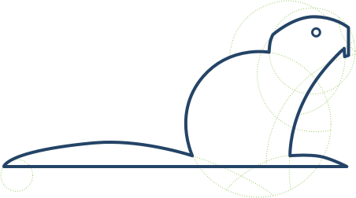

# Marmotta Builder
Build tool for Node.js Addons implemented by Node-API.

- **[Introduction](#introduction)**
- **[Code of Conduct](CODE_OF_CONDUCT.md)**
- **[Install](#install)**
- **[Usage](#usage)**
- **[Team](#team)**
- **[Acknowledgments](#acknowledgements)**
- **[License](#license)**

## Current Marmotta version: 0.0.1

(See [CHANGELOG.md](CHANGELOG.md) for complete Changelog)

## Introduction

`Marmotta` is a cross-platform command-line tool written in Node.js for 
compiling native addon implemented by [Node-API](https://nodejs.org/dist/latest/docs/api/n-api.html).

## Install

Instructions and options to install `Marmotta` builder tool.

## Usage

How to use `Marmotta` builder tool.

## Team members

### Nicola Del Gobbo

<https://github.com/NickNaso/>

<https://www.npmjs.com/~nicknaso>

<https://twitter.com/NickNaso>

## Acknowledgements

Thank you to all people that encourage me every day.

## License

Licensed under [Apache lecense Version 2.0](./LICENSE)
